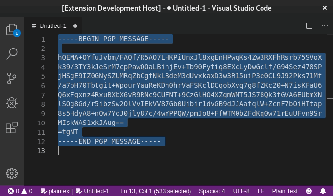

# VSCode GPG extension

Extension for using GnuPG for text encryption/decryption on VSCode.

## Features

- Listing public key available in the system for encryption.
- Text encryption producing ASCII-armored output (ready for sharing).
- Ciphertext decryption.
- Storing passphrases in local settings.


## Usage

**Note:** The extension allows encryption/decryption on the text editor as follows:

- For encryption, on a text editor, select your plaintext, access to the Command Palette (`Cmd+Shift+P` on OSX or `Ctrl+Shift+P` on Windows and Linux), choose `GPG: Encrypt` and follow the instructions.
- For decryption, select an encrypted text and choose `GPG: Decrypt` on the Command Palette. A prompt for providing the passphrase will be shown.

### Using stored passphrase in settings
- Edit your local `settings.json` and add the following:
  ```json
  {
      "gpg.passphrases": [
          {
              "email": "test@test.com",
              "description": "My PGP Test Key",
              "passphrase": "myRobustAndUniquePassphrase"
          }
      ]
  }
  ```
- The stored passphrase will be listed to chose to use for decryption.
  
> If no stored passphrase is chosen then the regular prompt will appear.

## Requirements

This extension depends upon [GnuPG](https://www.gnupg.org) `>=2.0` running on the host system. Please refer to the project website to find a compatible version with your system.

### For more information

- [OpenPGP](https://en.wikipedia.org/wiki/Pretty_Good_Privacy#OpenPGP)
- [The GNU Privacy Guard Project](https://www.gnupg.org)
- [GPGTools GPG Suite for OS X](https://gpgtools.org/)

-----------------------------------------------------------------------------------------------------------

**Enjoy!**
